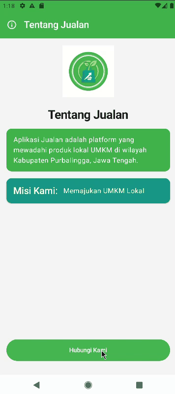
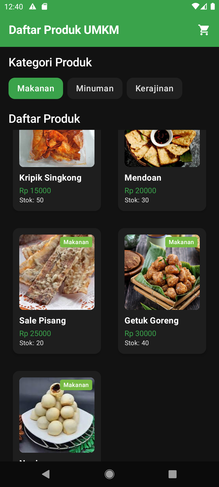
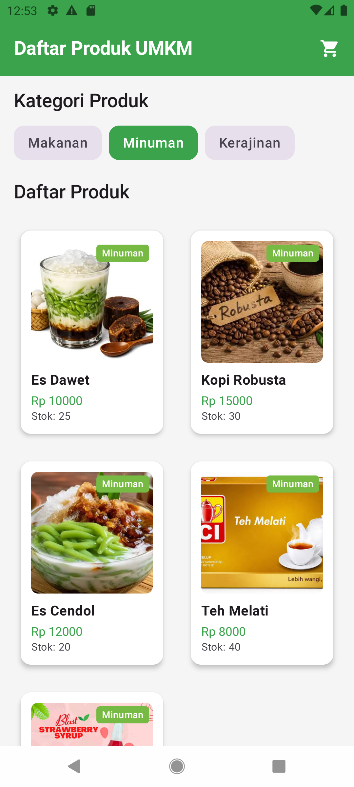
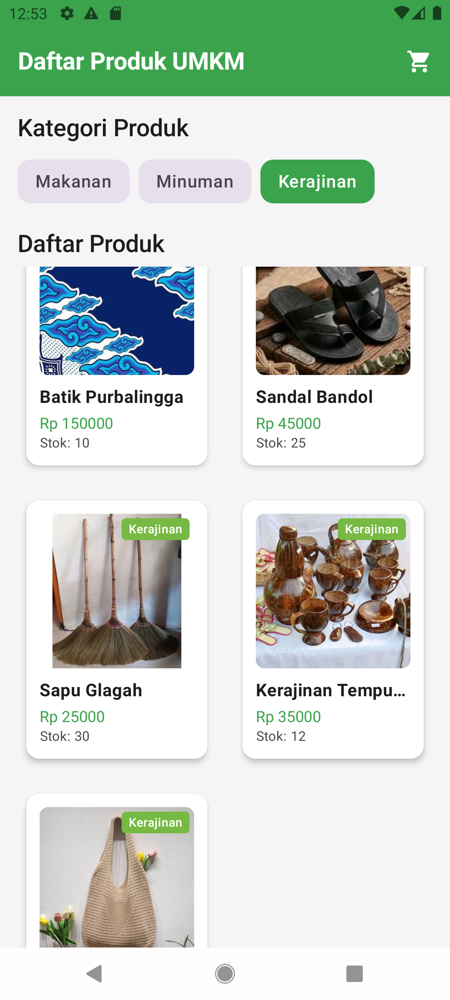
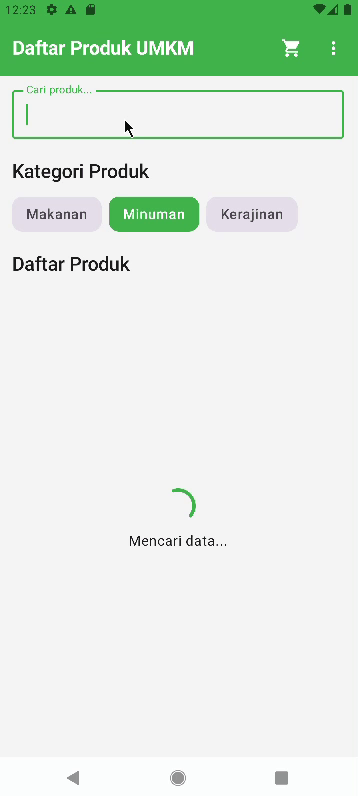

# Praktikum Pemrograman Mobile

## Identitas Mahasiswa

- **NAMA**: AGASTYA ITSAR MAULANA
- **NIM**: H1D024113
- **Shift Baru**: B
- **Shift KRS**: G

---

## Deskripsi Proyek

Aplikasi Android **Jualan** dibuat menggunakan Kotlin dan Jetpack Compose. Aplikasi ini merupakan tugas praktikum yang menampilkan antarmuka profil mengenai platform "Jualan", sebuah wadah produk lokal UMKM di wilayah Kabupaten Purbalingga, Jawa Tengah.

---

## Progres Praktikum

### Pertemuan 1: Dasar Jetpack Compose
- Pembangunan antarmuka deklaratif awal menggunakan Jetpack Compose.
- Menampilkan logo/ikon, judul, deskripsi singkat, dan misi platform Jualan.

### Pertemuan 2: Material Design 3 & Navigasi
- Penerapan komponen **Material Design 3**:
  - `Scaffold` & `TopAppBar` dengan tema warna kustom.
  - `Card` dan `OutlinedTextField` untuk input formulir interaktif.
  - `SnackbarHost` untuk notifikasi feedback pengiriman pesan.
  - Kustomisasi tipografi dan palet warna di `ui/theme/` (`Color.kt`, `Theme.kt`, `Type.kt`).
- Implementasi navigasi (`Jetpack Navigation Compose`):
  - **`BasicInfoScreen`**: Halaman informasi tentang platform Jualan.
  - **`HubungiKamiScreen`**: Halaman formulir kontak/pesan dengan validasi input dan umpan balik snackbar.

### Pertemuan 3: Dynamic Lists with Lazy Layouts
- Pembuatan Data Class `Category` dan `Product` untuk menstrukturkan data produk UMKM.
- Penyediaan data dummy lokal sebanyak 15 produk dalam 3 kategori (Makanan, Minuman, Kerajinan) menggunakan singleton `DummyData`.
- Implementasi kartu produk kustom (`ProductItemCard`) dengan gambar rasio 1:1, badge kategori, nama, harga, dan stok.
- Penggunaan **`LazyRow`** untuk daftar chip kategori produk secara horizontal yang dapat difilter dinamis.
- Penggunaan **`LazyVerticalGrid`** (2 kolom) untuk menampilkan daftar produk secara efisien dan responsif.
- Interaktivitas pesan notifikasi `Toast` saat setiap kartu produk diklik.
- Pembuatan `HomeActivity` sebagai pintu masuk utama (*Launcher Activity*) aplikasi.
- Pratinjau antarmuka `@Preview` dengan dukungan tema terang (*Light Mode*) dan tema gelap (*Dark Mode*).

### Pertemuan 4: Recomposition dan UI Lifecycle
- **State Hoisting & UDF**: Memisahkan komponen Stateful (`HubungiKamiScreen`, `DaftarProdukScreen`, `DetailProductScreen`) dan Stateless (`StatelessFormHubungiKami`, `StatelessDaftarProduct`, `StatelessDetailProduct`).
- **Pengelolaan State**: Menggunakan `remember` dan `rememberSaveable` untuk mempertahankan data formulir dan filter saat terjadi perubahan konfigurasi (*configuration change*).
- **Form Interaktif & Validasi Kompleks**:
  - Kolom input email dengan validasi karakter `@` dan pesan kesalahan pendukung (*supporting text*).
  - Kolom pesan dengan validasi panjang teks minimal 10 karakter.
  - Dropdown tipe pesan interaktif menggunakan `ExposedDropdownMenuBox`.
  - Integrasi pemilihan berkas galeri menggunakan `rememberLauncherForActivityResult` (`PickVisualMedia`) dan penampil status file terpilih.
  - Checkbox persetujuan syarat dan ketentuan.
  - Tombol submit yang aktif/nonaktif secara reaktif berdasarkan status validasi formulir dan menampilkan `Snackbar`.
- **Fitur Pencarian & Simulasi Asinkronus**:
  - Kolom pencarian produk terintegrasi dengan filter kategori produk.
  - Simulasi jeda pengambilan data dari internet menggunakan `LaunchedEffect` dan `delay(1000)` disertai indikator pemuatan `CircularProgressIndicator`.
- **Layar Detail Produk**:
  - Halaman detail dinamis berdasarkan ID produk.
  - Kontrol jumlah kuantitas beli (`-` dan `+`) yang dibatasi stok produk yang tersedia.
  - Notifikasi umpan balik `Toast` saat menambahkan produk ke keranjang belanja.
- **Navigasi Antarhalaman Terpadu**:
  - Konfigurasi `NavHost` pada `HomeActivity` menghubungkan halaman daftar produk, detail produk dengan argumen integer, dan halaman formulir kontak.
  - Penambahan menu aksi `MoreVert` pada `TopAppBar` untuk navigasi cepat ke halaman hubungi kami.

---

## Dokumentasi Tampilan

### 1. Tampilan Pemmob Pertemuan 1

  

### 2. Demo Aplikasi Pertemuan 2 (Material Design)

  

### 3. Tampilan Aplikasi Pertemuan 3 (Dynamic Lists with Lazy Layouts)

#### Kategori Makanan (Mode Gelap)

  

#### Kategori Minuman (Mode Terang)

  

#### Kategori Kerajinan (Mode Terang)

  

### 4. Demo Aplikasi Pertemuan 4 (Recomposition dan UI Lifecycle)

  

